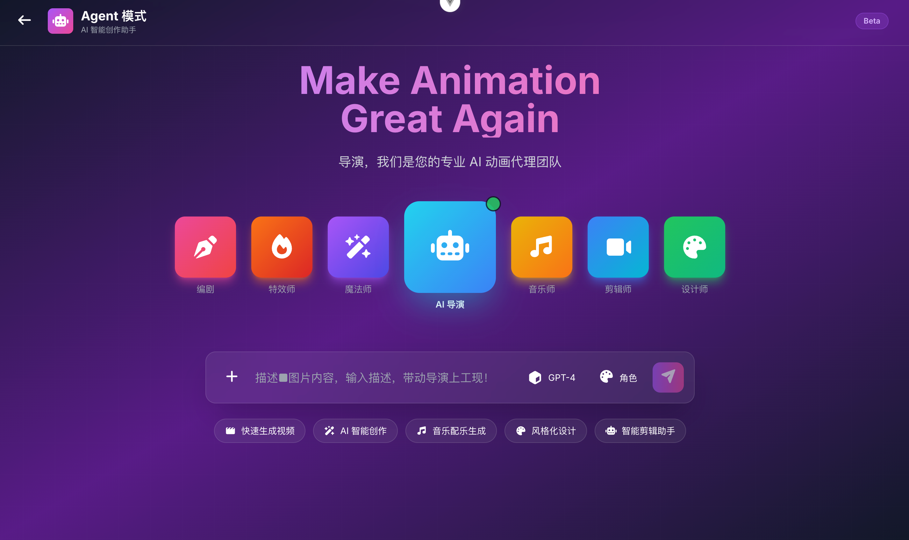

# WeiMeng (唯梦)


**[中文文档](./README_CN.md)**

## 🎬 Major Update: Agent-Team Director Mode

**Make Animation Great Again!**

We're excited to introduce the revolutionary **Agent-Team Director Mode** - your professional AI animation production team! This groundbreaking feature brings together a complete crew of AI specialists to transform your creative vision into reality.



### Meet Your AI Production Team

- **🎨 编剧 (Scriptwriter)**: Crafts compelling narratives and dialogue
- **🔥 特效师 (VFX Artist)**: Creates stunning visual effects
- **✨ 魔法师 (Magician)**: Adds creative magic to your scenes
- **🤖 AI 导演 (AI Director)**: Orchestrates the entire production workflow
- **🎵 音乐师 (Composer)**: Produces original soundtracks and audio
- **🎥 剪辑师 (Editor)**: Assembles and refines your final video
- **🎨 设计师 (Designer)**: Handles visual design and aesthetics

### Key Capabilities

- **快速生成视频 (Rapid Video Generation)**: Create videos in minutes
- **AI 智能创作 (AI Smart Creation)**: Intelligent content generation
- **音乐配乐生成 (Music Composition)**: Automated soundtrack creation
- **风格化设计 (Stylized Design)**: Customizable visual styles
- **智能剪辑助手 (Smart Editing Assistant)**: AI-powered editing tools

Simply describe your vision, and our AI team will bring it to life with professional quality!

---

## Overview

WeiMeng is an AI-assisted drama and video production platform that streamlines the entire creative workflow from script writing to final video editing. Developed by Sansishenyan (Beijing) Technology Co., Ltd.

## Features

- **Script Management**: Write, upload, and manage scripts with AI-powered continuation
- **Character Extraction**: Automatically extract characters from scripts with detailed profiles
- **Storyboard Generation**: AI-powered storyboard creation with customizable styles
- **Video Editing**: Timeline-based video editor with drag-and-drop functionality
- **Project Management**: Organize projects with team collaboration features
- **Multi-language Support**: Full internationalization (English/Chinese)

## Tech Stack

**Frontend**: Vue 3, Vite, Tailwind CSS, Vue Router, Vue I18n
**Backend**: FastAPI, Python 3.8+

## Quick Start

### Prerequisites

- Node.js 20.19.0+ or 22.12.0+
- Python 3.8+

### Frontend Setup

```bash
cd web-ui
npm install
npm run dev
```

Frontend runs at `http://localhost:5173`

### Backend Setup

```bash
cd src
pip install -r requirements.txt
python main.py
```

Backend runs at `http://localhost:7767`

## Project Structure

```
WeiMeng/
├── web-ui/          # Vue 3 frontend application
├── src/             # FastAPI backend application
├── docs/            # Documentation
└── logo.png         # Project logo
```

## Development

- Frontend dev server: `npm run dev` in `web-ui/`
- Backend dev server: `python main.py` in `src/`
- Build frontend: `npm run build` in `web-ui/`
