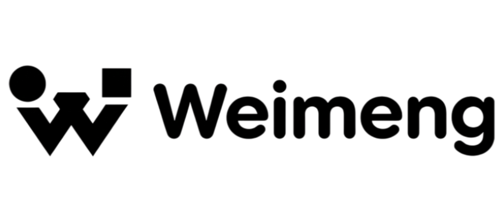

<div align="center">
  
  <p>
    <strong>A Multi-Agent System for Automated Video Production</strong>
  </p>
  <p>
    <a href="README_zh-CN.md">中文文档</a> | <strong>English</strong>
  </p>
</div>

---

## Introduction

WeiMeng is an intelligent multi-agent collaboration system powered by Large Language Models (LLMs), designed to automate video production workflows. Built with LangChain and LangGraph, and based on modular architecture design, it bridges the gap between conceptual multi-agent designs and engineering-level system implementation.

**Core Design Principles:**
- **Unified Entry**: Users interact with the system through a unified interface
- **Centralized Scheduling**: All agents coordinate through a central dispatcher, avoiding direct peer-to-peer communication
- **Task-First**: Tasks are first-class citizens; agents are executors
- **Traceable State**: Task states are fully traceable, interruptible, and reversible

## Tech Stack

### Backend
- **Framework**: FastAPI + Python 3.10+
- **Architecture**: Modular architecture with clear layer separation (API -> application -> domain -> infrastructure)
- **Database**: PostgreSQL + SQLAlchemy 2.0 async support
- **Cache**: Redis for session management and caching
- **AI Integration**: LangChain, LangGraph, LangFuse, OpenAI

### Frontend
- **Framework**: Next.js 16.1 + React 19
- **Language**: TypeScript
- **Styling**: Tailwind CSS 4
- **State Management**: Zustand

## Quick Start

### Prerequisites
- Docker & Docker Compose
- Node.js 18+ (for local development)
- Python 3.10+ (for local development)

### Docker Deployment

WeiMeng provides two Docker deployment modes. Use matching `.env` and compose files, and do not mix them.

**Mode A: MinIO (default)**

```bash
# Clone the repository
git clone https://github.com/CherryKingOne/WeiMeng.git
cd WeiMeng
cd docker

# MinIO mode
cp .env.example .env
docker compose -f docker-compose.yaml up -d

# View logs
docker compose -f docker-compose.yaml logs -f
```

**Mode B: RustFS (non-MinIO)**

```bash
# Clone the repository
git clone https://github.com/CherryKingOne/WeiMeng.git
cd WeiMeng
cd docker

# RustFS mode
cp .env.example.rustfs .env
docker compose -f docker-compose-rustfs.yaml up -d

# View logs
docker compose -f docker-compose-rustfs.yaml logs -f
```

After services start:
- Frontend: http://localhost:5678
- Backend API: http://localhost:5607
- API Documentation: http://localhost:5607/docs

### Local Development

**Backend:**
```bash
cd backend

# Install dependencies
pip install -r requirements.txt

# Configure environment variables
cp .env.example .env

# Start development server
python main.py
```

**Frontend:**
```bash
cd frontend

# Install dependencies
npm install

# Start development server
npm run dev
```

## System Architecture

### Core Components

- **Central Dispatcher**
  - The system's "Controller"
  - Unified user request intake
  - Coordinates all modules

- **Task Orchestrator**
  - The system's "Central Nervous System"
  - Decomposes tasks, dispatches them, collects results, and tracks status
  - The source of all tasks for other agents

- **Execution Agents**
  - Storyboard / Art Director / Animation & Editing
  - Only care about "what I need to do in this step"
  - Do not perceive the user's existence

- **Task State Store**
  - Task lifecycle and state machine
  - Supports interruption, failure, and retries

## Project Structure

```
WeiMeng/
├── backend/                    # Backend source code
│   ├── src/
│   │   ├── modules/            # Business modules
│   │   │   ├── auth/           # Authentication module
│   │   │   │   ├── api/        # API routes
│   │   │   │   ├── application/  # Application layer (DTOs, services)
│   │   │   │   ├── domain/     # Domain layer (entities, repositories)
│   │   │   │   └── infrastructure/  # Infrastructure (models, mappers)
│   │   │   ├── captcha/        # Captcha module
│   │   │   │   ├── api/
│   │   │   │   ├── application/
│   │   │   │   ├── domain/
│   │   │   │   └── infrastructure/
│   │   │   └── scripts/        # Scripts management module
│   │   │       ├── api/
│   │   │       ├── application/
│   │   │       ├── domain/
│   │   │       └── infrastructure/
│   │   ├── shared/             # Shared infrastructure
│   │   │   ├── common/         # Common utilities
│   │   │   ├── domain/         # Domain base classes
│   │   │   ├── infrastructure/ # Infrastructure (database, Redis)
│   │   │   ├── security/       # Security components (JWT, password)
│   │   │   ├── middleware/     # Middleware
│   │   │   └── extensions/     # Extensions (email, storage)
│   │   └── api/                # API routes
│   │       └── v1/             # API v1 endpoints
│   ├── config/                 # Configuration files
│   ├── tests/                  # Test code
│   │   ├── unit/               # Unit tests
│   │   └── integration/        # Integration tests
│   └── main.py                 # Application entry
│
├── frontend/                   # Frontend source code
│   ├── app/                    # Next.js App Router
│   │   └── [locale]/           # Internationalization
│   │       ├── (public-sidebar)/  # Pages with sidebar
│   │       │   ├── assets/     # Assets management
│   │       │   ├── plugins/    # Plugins page
│   │       │   ├── projects/   # Projects page
│   │       │   ├── scripts/    # Scripts page
│   │       │   ├── weimeng/    # WeiMeng home
│   │       │   └── workflows/  # Workflows page
│   │       ├── auth/           # Auth pages
│   │       │   ├── forgot-password/
│   │       │   ├── login/
│   │       │   └── signup/
│   │       ├── workbench/      # Workbench tools
│   │       │   ├── image2image/
│   │       │   ├── image2video/
│   │       │   ├── text2image/
│   │       │   └── text2video/
│   │       └── workflows/workflow-editor/
│   ├── components/
│   │   ├── features/           # Business components
│   │   │   ├── asset/
│   │   │   ├── plugin/
│   │   │   ├── project/
│   │   │   ├── script/
│   │   │   ├── settings/
│   │   │   ├── workbench/
│   │   │   └── workflow/
│   │   ├── layout/             # Layout components
│   │   └── ui/                 # UI component library
│   ├── config/                 # App configuration
│   ├── constants/              # Constants
│   ├── hooks/                  # Custom hooks
│   ├── services/               # API service layer
│   ├── stores/                 # State management (Zustand)
│   ├── types/                  # TypeScript type definitions
│   └── utils/                  # Utility functions
│
├── docker/                     # Docker configuration
│   ├── docker-compose.yaml     # Container orchestration
│   ├── docker-compose-rustfs.yaml  # RustFS deployment orchestration
│   ├── .env.example            # MinIO environment template
│   └── .env.example.rustfs     # RustFS environment template
│
├── docs/                       # Documentation
│   └── image/                  # Image resources
│
└── 原型图/                      # HTML prototypes
```

## Features

### User Authentication
- Email registration and login
- JWT token authentication
- Password reset
- Email verification code

### Workflow Management
- Visual workflow editor
- Drag-and-drop node orchestration
- Real-time preview and execution
- Workflow templates

### Resource Management
- Project management
- Asset library
- Script management
- Plugin system

## API Endpoints

### Authentication
- `POST /api/v1/auth/register` - User registration
- `POST /api/v1/auth/login` - User login
- `POST /api/v1/auth/logout` - User logout
- `POST /api/v1/auth/reset-password` - Password reset

### Captcha
- `POST /api/v1/captcha/email/send` - Send email verification code

### Health Check
- `GET /health` - Service health status

For complete API documentation, visit: http://localhost:5607/docs

## Environment Variables

### Backend Environment Variables

```bash
# Application
APP_ENV=development
APP_NAME=WeiMeng
SECRET_KEY=your-secret-key

# Database
POSTGRESQL_HOST=localhost
POSTGRESQL_PORT=5432
POSTGRESQL_USER=weimeng
POSTGRESQL_PASSWORD=weimeng
POSTGRESQL_NAME=weimeng

# Redis
REDIS_HOST=localhost
REDIS_PORT=6379
REDIS_PASSWORD=weimeng

# Email
SMTP_HOST=smtp.example.com
SMTP_PORT=587
SMTP_USER=user@example.com
SMTP_PASSWORD=secret

# Model Provider Keys
# Configure provider API keys via backend API `/api/v1/providers`.
# Keys are encrypted at rest in PostgreSQL.
```

### Frontend Environment Variables

```bash
NEXT_PUBLIC_API_URL=http://localhost:5607
NEXT_PUBLIC_APP_URL=http://localhost:5678
```

## Development Guide

### Backend Development

```bash
# Run tests
pytest

# Test coverage
pytest --cov=src --cov-report=html

# Code formatting
black src tests

# Linting
ruff check src tests
```

### Frontend Development

```bash
# Build for production
npm run build

# Start production server
npm start

# Linting
npm run lint
```

## License

This project is licensed under the Apache License 2.0 - see the [LICENSE](LICENSE) file for details.

**Logo Usage Restrictions**

The project logo (`docs/image/logo.png`) is NOT covered by the standard Apache License 2.0 permissions:
1. **Non-Commercial**: You may NOT use the logo for any commercial purposes
2. **No Modifications**: You must NOT modify, alter, or distort the logo image

---

<div align="center">
  <p>Made with care by WeiMeng Team</p>
</div>
