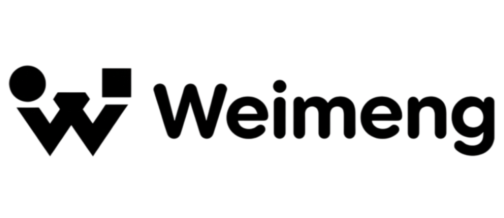

<div align="center">
  
  <p>
    <strong>面向自动化视频制作的多 Agent 系统</strong>
  </p>
  <p>
    <strong>中文文档</strong> | <a href="README.md">English</a>
  </p>
</div>

> **WeiMeng** 是一个基于大语言模型（LLM）的智能多 Agent 协作系统

---

## 📖 简介

WeiMeng 是一个先进的多 Agent 系统，旨在实现视频制作工作流的自动化。它填补了概念级多 Agent 设计与工程级系统实现之间的空白。

## 🚀 快速开始

### Docker 部署

```bash
cd WeiMeng
cd docker
cp .env.example .env
docker compose up -d
```

核心设计原则包括：
- **统一入口**：用户通过统一接口与系统交互。
- **集中式调度**：所有 Agent 通过调度中枢进行协调，避免点对点的直接通信。
- **任务至上**：任务是第一公民，Agent 是执行者。
- **状态可溯**：任务状态完全可追踪、可中断、可回滚。

## 🏗 系统架构

系统由调度中枢、任务规划器以及专业的执行 Agent（分镜师、艺术总监、动画/剪辑师）组成。


### 核心架构说明

- **调度中枢**
  - 系统“总控”
  - 统一接收用户请求
  - 协调各模块工作

- **任务规划器**
  - 系统“中枢神经”
  - 拆任务、派任务、收结果、记状态
  - 所有 Agent 的任务都从这里来

- **执行型 Agent**
  - 分镜师 / 艺术总监 / 动画剪辑
  - 只关心“我这一步要做什么”
  - 不感知用户存在

- **Task State Store**
  - 任务生命周期与状态机
  - 支持中断、失败、重试

## 🔄 任务流程

系统确保每个任务从创建到完成都有一个结构化的生命周期。


## 📂 文档

详细文档位于 `docs` 目录中：

- [开发文档](docs/Development_Guide.md)：系统设计与实现的综合指南。
- [系统架构图注释](docs/System_Architecture_Notes.md)：关于系统结构的详细说明。
- [状态流责任划分](docs/State_Flow_Responsibility.md)：不同任务状态下的责任细分。

## 📁 目录结构

```
WeiMeng/
├── backend/                # 后端源代码 (Python/FastAPI)
│   ├── src/
│   │   ├── modules/        # 业务模块 (agent, captcha 等)
│   │   └── shared/         # 共享基础设施 (domain, infrastructure, security, middleware)
│   ├── config/             # 配置模块 (settings, ai, email, redis, database)
│   ├── tests/              # 测试代码
│   ├── main.py             # 应用入口
│   └── ...                 # 配置文件 (Dockerfile, pyproject.toml, requirements.txt 等)
├── frontend/               # 前端源代码 (Next.js/React)
│   ├── app/                # 应用页面 ((auth), (dashboard), workflow-editor 等)
│   ├── components/         # 组件 (features 业务组件)
│   ├── hooks/              # 自定义 Hooks
│   ├── services/           # API 服务
│   ├── types/              # TypeScript 类型定义
│   ├── config/             # 前端配置 (theme, navigation 等)
│   └── ...                 # 配置文件 (package.json, next.config.ts, docker-compose.yml 等)
├── docker/                 # Docker 配置文件
│   ├── docker-compose.yaml # Docker Compose 配置
│   ├── .env.example       # 环境变量示例
│   └── README.md          # Docker 部署说明
└── README_zh-CN.md         # 项目入口 (中文)
```

## 📄 许可证 (License)

本项目采用 Apache License 2.0 许可证 - 详情请参阅 [LICENSE](LICENSE) 文件。

**重要提示：Logo 使用限制**
项目 Logo (`docs/image/logo.png`) 不受 Apache License 2.0 标准权限覆盖，必须遵守以下限制：
1. **禁止商用**：严禁将 Logo 用于任何商业目的。
2. **禁止修改**：严禁修改、篡改或扭曲 Logo 图像。若使用本项目，必须保持 Logo 原样。
